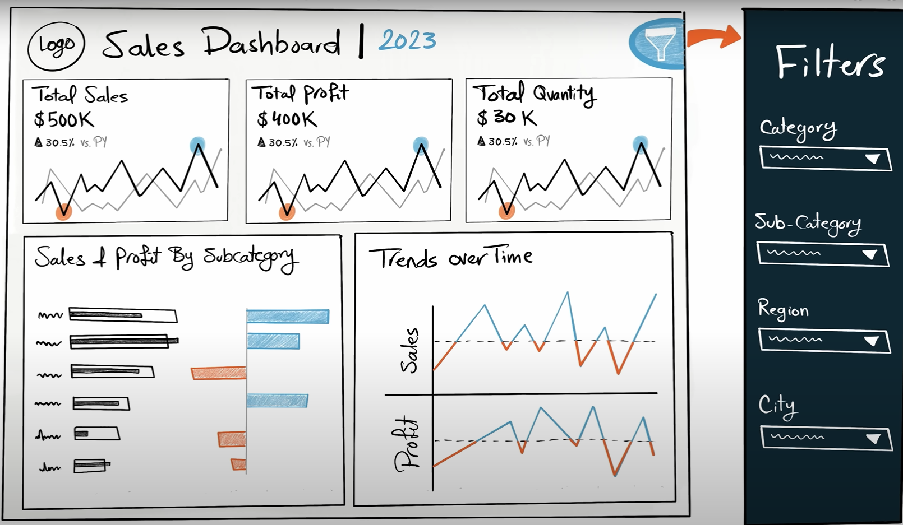

  

# 1- Analysing Requirements

This user story outlines the specifications for building two dashboards using Tableau to help stakeholders, including sales managers and executives to analyze sales performance and customers.

## Sales Dashboard | Requirements

### Dashboard Purpose
The purpose of sales dashboard is to present an overview of the sales metrics and trends in order to analyze year-over-year sales performance and understand sales trends.
### Key Requirements

#### KPI Overview
* Display a summary of total sales, profits and quantity for the current year and the previous year
#### Sales Trends
* Present the data for each KPI on a monthly basis for both the current year and the previous year
* Identify months with highest and lowest sales and make them easy to recognize

#### Product Subcategory Comparison
* Compare sales performance by different product subcategories for the current year and the previous year
* Include a comparison of sales with profit

#### Weekly Trends for Sales & Profit

* Present weekly sales and profit sdadta for the current year
* Display the average weekly values
* Highlight weeks that are above and below the average to draw attention to sales & profit performance