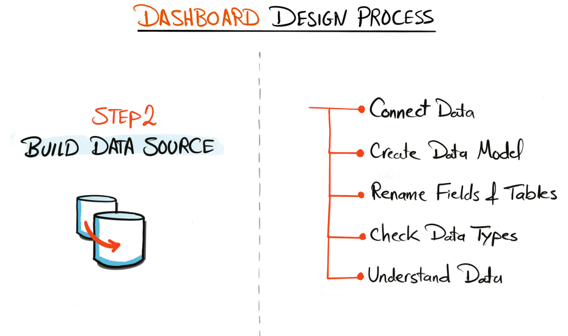

# 2- Building Data Sources

  

## 2.1 Connecting the Data

💡 ***Tip*** Before building the data model, we need to learn which tables are dimensions or facts.

## 2.2 Creating the Data Model

## 2.3 Renaming Fields/Tables

## 2.4 Checking Data Types

## 2.5 Understanding the Data