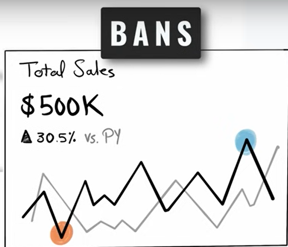
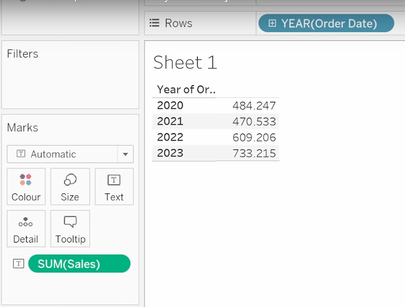
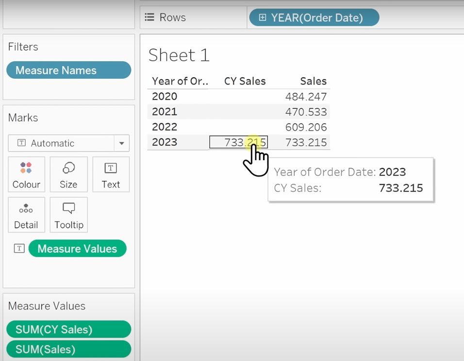
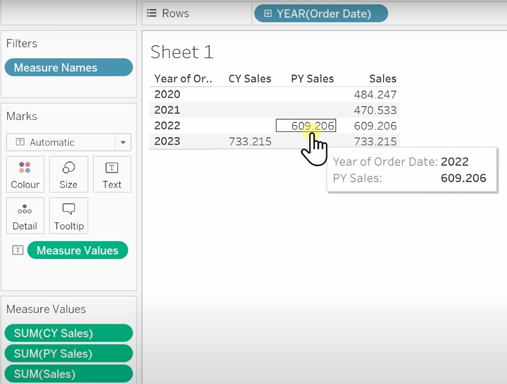
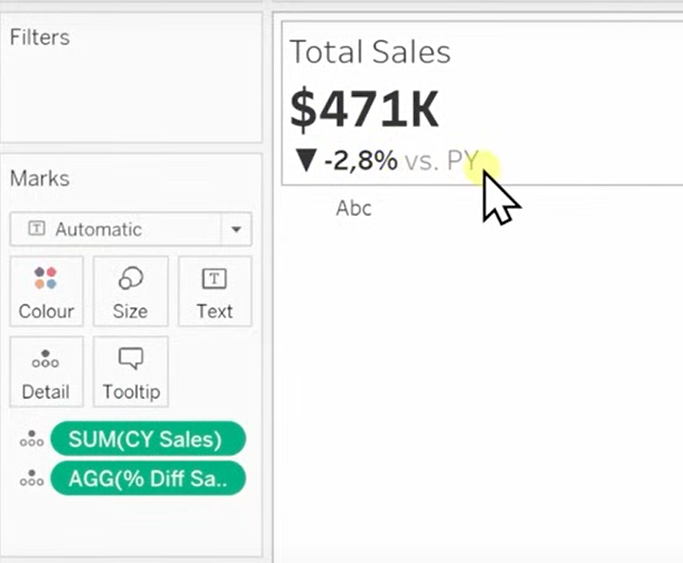
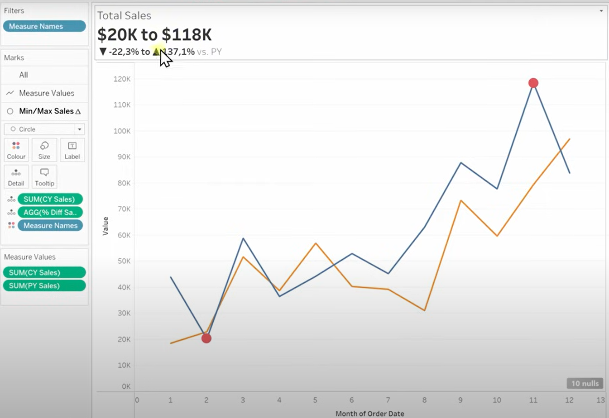
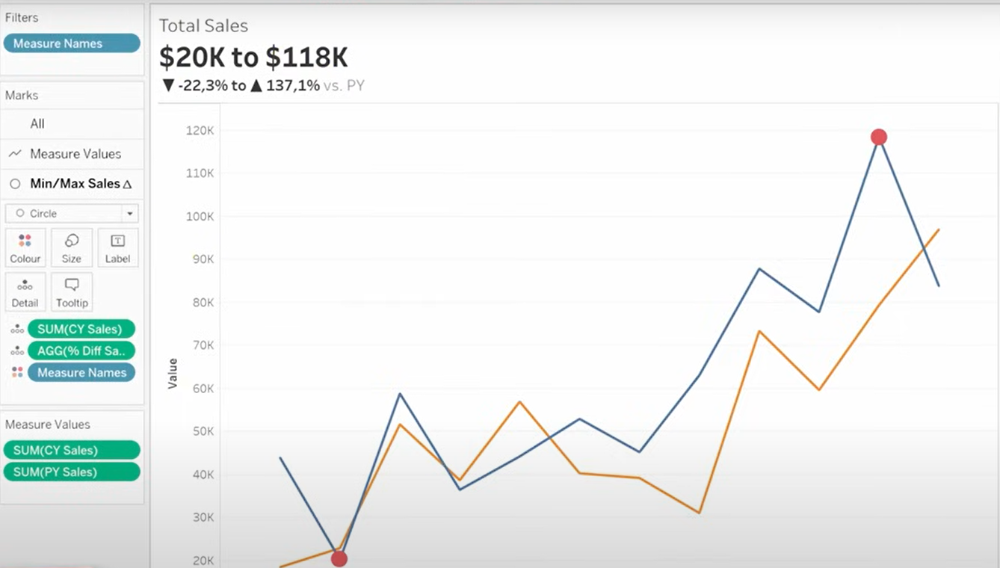
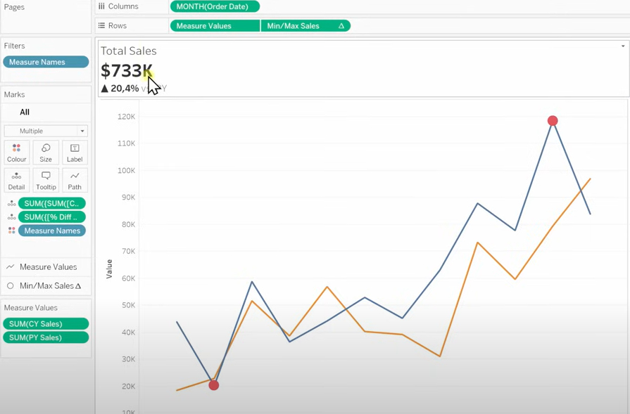

# 3- Building Charts

<p align="center">
  
</p>

We start with creating the first ban chart for Total Sales. The procedure will be similar for Total Profit & Total Quantity bans.
<p align="center">
  
</p>

By dropping Sales in the Text Marks and selecting Order Date as our rows, we see that we have the total sales for years 2020 to 2023.
<p align="center">
  
</p>

## 3.1 Creating calculated fields & test

We will create a calculated field regarding the KPI requirements so that we can only have the sales of the current year. We'll call this 'CY Sales' and we define it as follows:

```
  IF YEAR([Order Date]) = 2023 THEN [Sales]
  END
```
<p align="center">
  
</p>

We can create a similar calculated field for the sales of the previous year. We'll call this 'PY Sales' and define it accordingly:

```
  IF YEAR([Order Date]) = 2022 THEN [Sales]
  END
```

<p align="center">
  
</p>

Now, how can we make the dashboard dynamic? By using parameters to allow users to check historical data to select any desired year.
We start off with creating a calculated field that returns the value of the year from Order Date called 'Order Date(Year)', defined as follows:

```
  YEAR([Order Date])
```
Now, we can create a parameter called 'Select Year':

<p align="center">
  
</p>

Then, it's time to link our parameter to our calculated fields by editing them as follows:


```
  IF YEAR([Order Date]) = [Select Year] THEN [Sales]
  END
```
```
  IF YEAR([Order Date]) = [Select Year]-1 THEN [Sales]
  END
```
We've calculated the amount of sales for the current and previous year. Now, it's the time to calculate their differences in percentage. We call it '% Diff Sales', defined as follows:

```
  (SUM([CY Sales]) - SUM([PY Sales])) / SUM([PY Sales])
```
We'll put all the bans info in the title part and include the sparkline chart as well in one sheet.
```
  Total Sales
  <SUM(CY Sales)>
  <AGG(% Diff Sales)> vs. PY
```

We can provide the following custom format for difference percentage KPI:

▲ 0.0%; ▼ -0.0%;

<p align="center">
  
</p>


## 3.2 Building the charts

🛑*** Problem *** Continuous measures in visualization leads to a range of values in the title.

<p align="center">
  
</p>

Note that how after adding the sparkline chart on top of each other, our bans info broke. We'll put a pin on this and will take care of it later. First, let's add the min/max circles in our sales charts. We create a calculated field called 'Min/Max Sales', defined as follows:


```
  IF SUM([CY Sales]) = WINDOW_MAX(SUM([CY Sales]))
  THEN SUM([CY Sales])
  ELSIF SUM([CY Sales]) = WINDOW_MIN(SUM([CY Sales]))
  THEN SUM([CY Sales])
  END
```
Remember to choose dual axis so that the circles would be placed on top of the line charts rather than separated.

<p align="center">
  
</p>

Now,to fix the problem we faced in our bans section when we added the sparkline charts, we can do the following LOD trick(Level of Detail):

We edit our marks by wrapping them in curly brackets,{}, and then, edit our bans info by chosing the new marks:

```
  Total Sales
  <SUM({SUM([CY Sales])})>
  <SUM({[% Diff Sales]})>vs. PY

```

Everything is back to normal now!

<p align="center">
  
</p>


## 3.3 Formatting

### 3.3.1 Removing Lines & Grids
### 3.3.2 Cleaning up Axis & Headers
### 3.3.3 Coloring
### 3.3.4 Tooltip

💡*** Minimalism is key *** Excessive info on dashboard can distract users from the important data.

💡*** Tip *** Add your design colors to the 'Custom Colors' to reuse them in all charts.

CY Sales #212121
PY Sales #cecece
Max #1da2d0
Min #ff5500

```
  Sales of <MONTH(Order Date)>,<ATTR(Current Year)>:<SUM(CY Sales)>
  Sales of <MONTH(Order Date)>,<ATTR(Previous Year)>:SUM(PY Sales)
  Sales Differences:<AGG(% Diff Sales)>
  Highest/Lowest Sales:<AGG(Min/Max Sales)>
```

🗒️ *** Note *** Use tabs between values for alignment in tooltips.