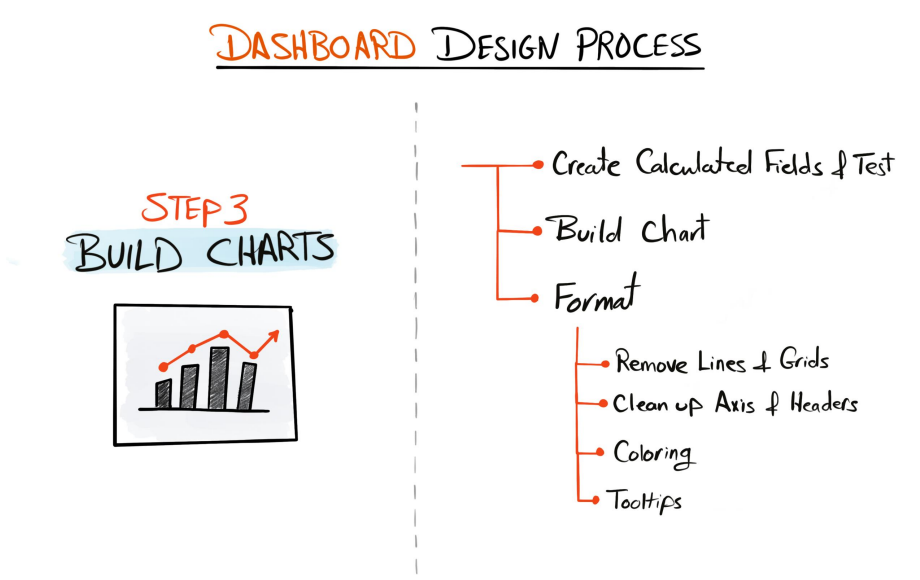

# 3- Building Charts

<p align="center">
  
</p>


## 3.1 Creating calculated fields & test

```
  IF YEAR([Order Date]) = 2023 THEN [Sales]
  END
```
```
  IF YEAR([Order Date]) = 2022 THEN [Sales]
  END
```
```
  IF YEAR([Order Date]) = [Select Year] THEN [Sales]
  END
```
```
  IF YEAR([Order Date]) = [Select Year]-1 THEN [Sales]
  END
```
## 3.2 Building the charts

## 3.3 Formatting
