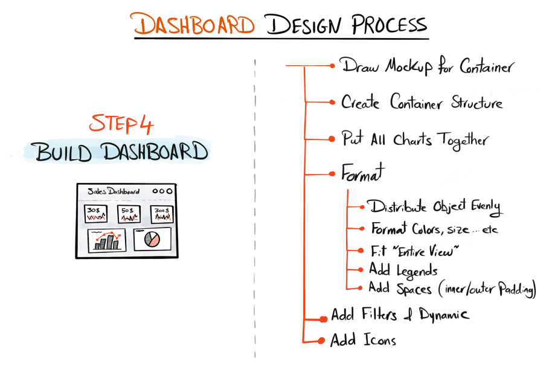
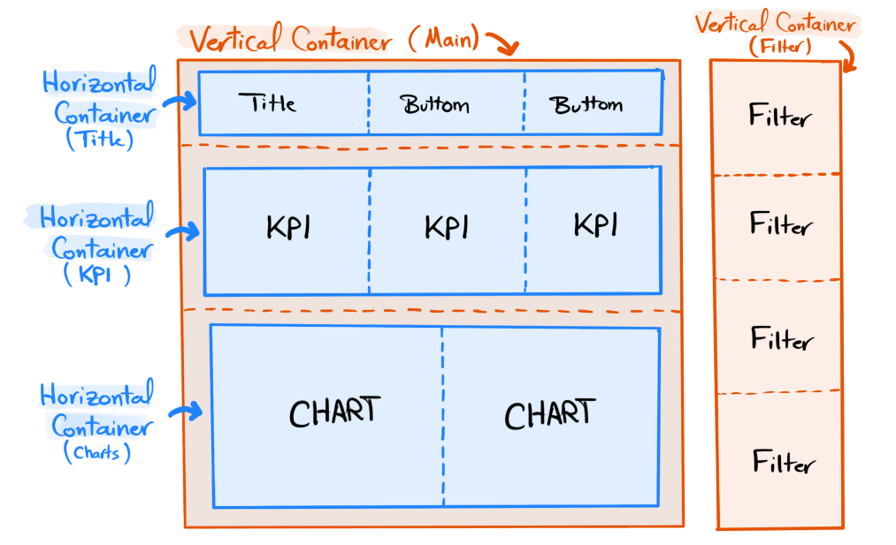
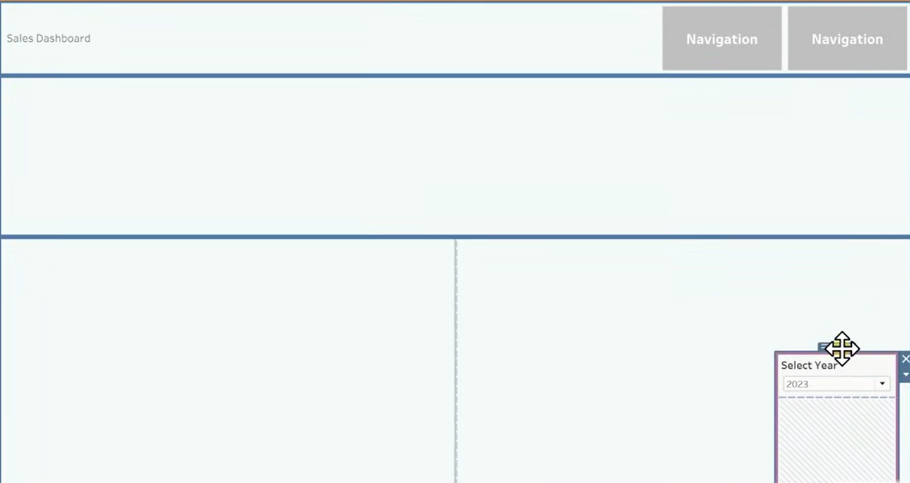
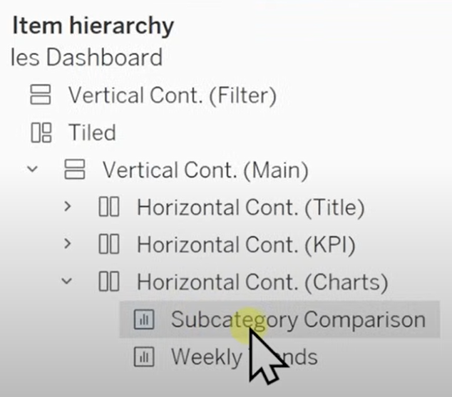
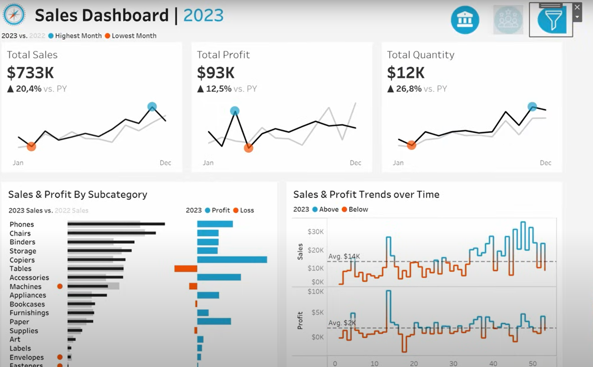

# 4- Building Dashboards

  

## 4.1 Drawing Mockups for Containers

  

## 4.2 Building Container Structure

For the sales dashboard, we are going with fixed size of 1200 x 800. 

💡 ** Tip ** Always start by creating floating containers before tiled containers.

  

  

## 4.3 Putting all Charts Together

## 4.4 Formatting

## 4.5 Adding Filters & Dynamics

## 4.6 Adding Icons

  

