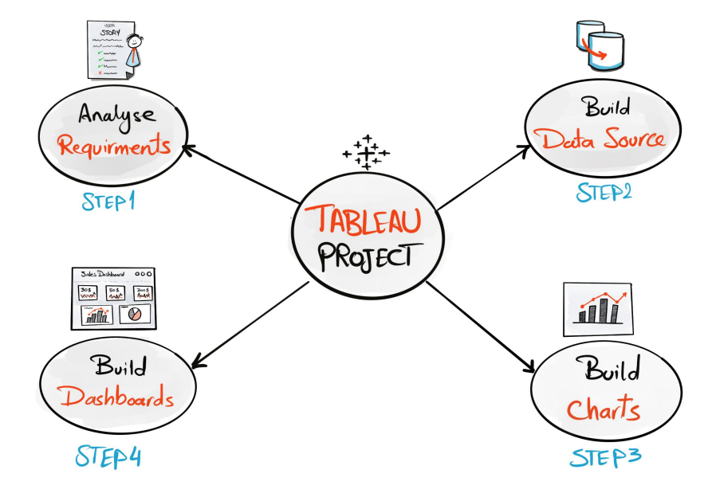

  

# Tableau Sales and Customers Dashboard

Welcome to the Tableau Dashboard Project! This project is designed to guide you through the end-to-end process of creating a dynamic and visually compelling dashboard in Tableau. Each section covers critical steps, from analyzing initial requirements to building charts and dashboards, with a focus on best practices in data visualization.

This README provides an overview of the project steps. You can explore each section in detail by following the links to individual README files for each step.

## Project Steps

* [Analyzing Requirements](./1-Analysing-requirements/README.md)
We begin by gathering and defining the requirements for the dashboard. This involves understanding the data's purpose, choosing appropriate visualization types, drawing initial mockups, and selecting a color scheme that enhances readability and user engagement.

* [Building the Data Sources](./2-Building-data-sources/README.md)
We connect to the data source and prepare it for visualization. This includes creating a data model, renaming fields, checking data types, and ensuring you have a clear understanding of the data's structure.

* [Building the Charts](./3-Building-charts/README.md)
We start constructing charts based on the requirements. This step includes creating calculated fields, formatting charts, and refining the layout by removing unnecessary elements, adjusting colors, and enhancing tooltips.

* [Building the Dashboards](./4-Building-dashboard/README.md)
We assemble the dashboard by organizing charts, adding interactive filters, and formatting the layout. This step involves refining the design to ensure a user-friendly and visually appealing final product.